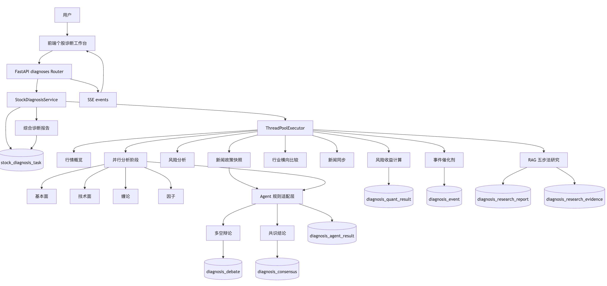
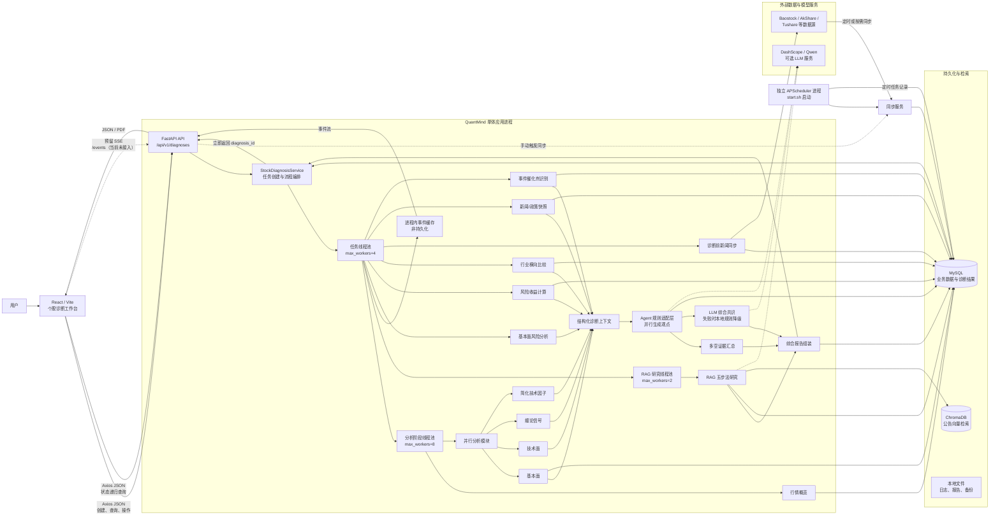
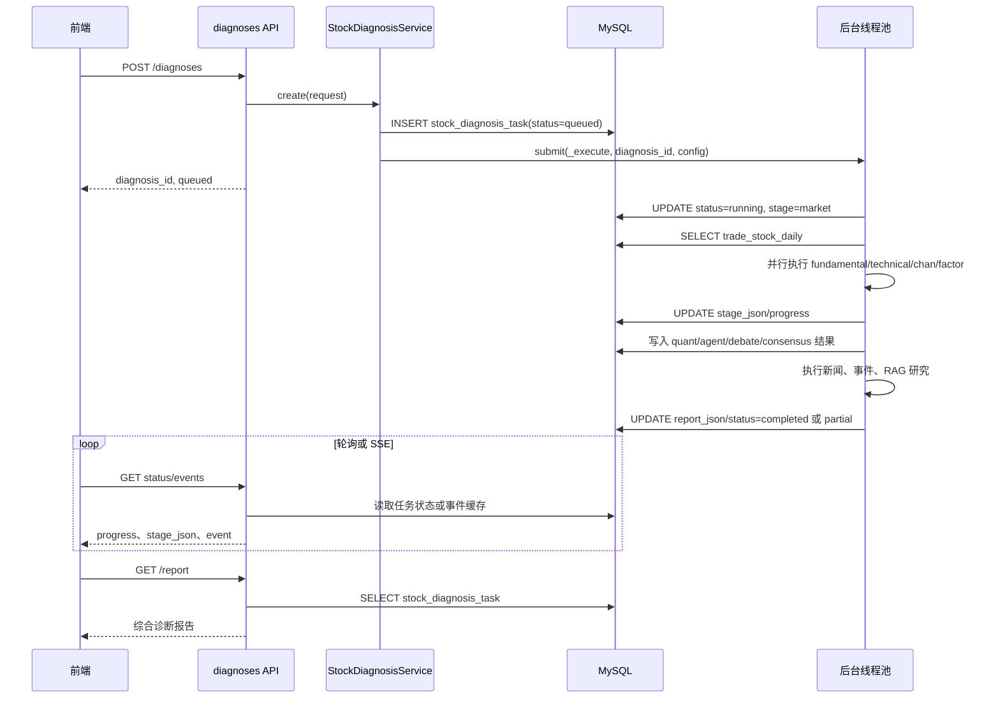

# 个股诊断模块架构与实现说明

> 本文档基于当前仓库代码整理，描述已实现的个股诊断功能、数据流、后台交互和持久化设计。文档中的“当前实现”以代码为准，不等同于未来规划。

## 1. 模块定位

个股诊断是一个异步分析工作流。用户从前端选择股票、分析模块、日期范围和 Agent 配置后，后端创建诊断任务并立即返回 `diagnosis_id`。后台线程执行多阶段分析，阶段结果写入主任务快照及辅助结果表，前端通过状态接口轮询结果；后端同时提供 SSE 事件接口用于实时进度消费。

当前系统的核心编排类是 `StockDiagnosisService`，主入口为 `app/api/diagnoses.py`，前端页面主要位于 `frontend/src/App.tsx`。

## 2. 总体架构图

> 这张图按当前代码的真实运行方式绘制：系统是单体 FastAPI 应用，诊断后台任务使用进程内线程池，不是独立的消息队列或 Worker 集群；前端当前通过 `GET /status` 递归定时查询任务状态和报告，后端的 SSE `/events` 接口已提供但当前前端页面未接入。



### 图中最重要的实现边界

1. **请求与执行解耦**：`POST /diagnoses` 只负责校验、创建 `stock_diagnosis_task` 并提交线程池，立即返回 `diagnosis_id`；结果通过状态接口、报告接口和可选 SSE 获取。
2. **诊断流程是“并行分析 + 串行编排”**：行情概览完成后，基本面、技术面、缠论和因子并行；随后依次执行风险收益、行业比较、新闻与事件、Agent、Debate/Consensus、RAG 研究和综合报告。
3. **Agent 不是独立智能体服务**：当前 Agent 主要是结构化结果的规则适配器；最终共识优先调用 LLM，失败时使用本地规则降级。
4. **调度器与 API 的部署方式可分离**：`start.sh` 以独立进程启动调度器，并将 API 的内置调度器关闭，避免重复执行定时任务；直接运行 `python run.py` 时则可由 API 进程内启动调度器。
5. **事件与任务状态的可靠性不同**：任务状态、阶段快照和报告写入 MySQL；SSE 事件暂存于 API 进程内存，进程重启后不会保留。 

## 3. 分层职责

### 3.1 前端层

主要代码：

- `frontend/src/App.tsx:448-481`：个股诊断页面及页面挂载。
- `frontend/src/api/client.ts:110-141`：诊断相关 API 封装。
- `frontend/src/styles.css`：页面样式。

前端负责：

1. 股票搜索和股票选择。
2. 诊断参数配置。
3. 发起诊断任务。
4. 展示任务状态、阶段进度和结果。
5. 展示基本面、技术面、缠论、因子、风险收益、Agent、Debate、Consensus 等结果。
6. 创建研究报告、查看历史诊断和导出报告。
7. 处理取消、重试等用户操作。

当前页面实际以状态查询为主要结果获取方式，后端虽提供 SSE `/events` 接口，但前端是否使用 SSE 应以对应页面代码为准，不能将 SSE 视为唯一交互机制。

### 3.2 API 层

主要代码：`app/api/diagnoses.py`。

Router 在 `app/main.py:131` 附近注册。API 层主要负责参数解析、请求校验、调用服务和转换响应，不承载具体分析算法。

主要接口：

| 功能 | HTTP 接口 |
|---|---|
| 股票搜索 | `GET /diagnoses/stocks/search` |
| 股票概览 | `GET /diagnoses/stocks/{symbol}/overview` |
| 创建诊断 | `POST /diagnoses` |
| 历史任务 | `GET /diagnoses` |
| 任务状态 | `GET /diagnoses/{id}/status` |
| 综合报告 | `GET /diagnoses/{id}/report` |
| 研究报告创建 | `POST /diagnoses/{id}/research-report` |
| 研究报告查询 | `GET /diagnoses/{id}/research-report` |
| 事件分析 | `POST /diagnoses/{id}/event-analysis` |
| 风险收益 | `GET /diagnoses/{id}/risk-reward` |
| 行业比较 | `GET /diagnoses/{id}/industry-comparison` |
| Agent 结果 | `GET /diagnoses/{id}/agents` |
| Debate | `GET /diagnoses/{id}/debate` |
| Consensus | `GET /diagnoses/{id}/consensus` |
| 实时事件 | `GET /diagnoses/{id}/events` |
| 取消任务 | `POST /diagnoses/{id}/cancel` |
| 重试任务 | `POST /diagnoses/{id}/retry` |
| 导出报告 | `GET /diagnoses/{id}/export` |

## 4. 主业务流程

### 4.1 创建任务

入口：`app/api/diagnoses.py` 中的 `POST /diagnoses`，核心服务：`app/services/stock_diagnosis.py` 的 `StockDiagnosisService.create()`。

流程如下：

```text
前端提交 DiagnosisRequest
  -> API 校验股票、模块、周期、日期范围
  -> 查询/确认股票概览
  -> 生成 diagnosis_id
  -> 组装 config
  -> INSERT stock_diagnosis_task
  -> 提交 ThreadPoolExecutor 后台任务
  -> 立即返回 diagnosis_id 和 queued 状态
```

主配置通常包含：

- `symbol`
- `stock_name`
- `periods`
- `modules`
- `agent_types`
- `date_range`
- `force_refresh`
- `refresh_news`

模块常量在 `stock_diagnosis.py` 中定义，基础模块包括 `market`、`fundamental`、`technical`、`chan`、`factor`、`risk`。当前实现主要支持日线、周线等配置；分钟周期必须以运行时实现为准，不能仅依据前端选项判断已完整支持。

### 4.2 后台执行总流程

核心方法：`app/services/stock_diagnosis.py:206-330` 的 `_execute()`。

```text
queued
  -> running / market
  -> 读取行情并生成 market
  -> fundamental、technical、chan、factor 并行执行
  -> risk
  -> quantitative：风险收益
  -> industry_comparison：行业横向比较
  -> news_sync：可选新闻同步
  -> news_policy：新闻政策快照
  -> event_analysis：事件催化剂识别
  -> agent_analysis：生成各 Agent 观点
  -> debate：汇总多空观点
  -> consensus：生成综合共识
  -> 持久化量化和 Agent 快照
  -> research_report：RAG 五步法
  -> report：组装综合报告
  -> completed / partial
```

每个阶段通过 `_update()` 更新数据库，通过 `_emit()` 写入进程内事件缓存。

### 4.3 阶段一：行情概览

方法：`StockDiagnosisService._market()`。

数据源为 `trade_stock_daily`，查询条件包括：

- 当前股票代码。
- `adjustflag=2`，即前复权数据。
- 用户配置的起止日期。

返回内容包括：

- 最新交易日期和数据截止日期 `data_as_of`。
- 收盘价、涨跌幅、成交量、成交额、换手率。
- 最近一段行情序列。
- 数据源和复权标记。

如果行情为空，会直接抛出“前复权行情数据为空”，主任务进入 `failed`。

### 4.4 阶段二：并行分析

`_execute()` 使用 `stage_executor` 为选中的分析模块提交 Future。阶段入口是 `_run_stage()`：

- `fundamental` -> `_fundamental()`
- `technical` -> `_technical()`
- `chan` -> `_chan()`
- 其他分析模块 -> `_factor()`

每个阶段开始时发送 `diagnosis.stage.started`，完成或失败时发送对应事件。阶段失败会记录到 `errors`，但不会立即终止其他阶段，最终可能形成 `partial` 结果。

#### 基本面

`_fundamental()` 查询 `trade_stock_financial` 最近 8 期数据，使用收入、净利润、EPS、ROE、ROA、毛利率、净利率、负债率、流动比率、经营现金流、资产和权益等指标。

如果最近财务明细不足，会调用 `sync_financial(stock_codes=[symbol], quarters=4, enrich_detail=True)` 尝试补全，然后重新查询。结果包含：

- 最近报告期。
- 指标值、数据日期、数据来源。
- 历史财务记录。
- 基本面评分。
- `healthy` 或 `partial` 状态。

#### 技术面

`_technical()` 基于行情 DataFrame 计算技术指标和技术信号，输入来自 `trade_stock_daily`。其结果会被风险收益模块使用，因此技术面失败可能影响后续风险收益计算。

返回结果示例：
```json
{
  "signal_date": "2026-08-31",
  "metrics": {
    "ma5": 12.36,
    "ma10": 12.18,
    "ma20": 11.95,
    "ma60": 11.42,
    "ma120": 10.87,
    "rsi14": 64.28,
    "dif": 0.183,
    "dea": 0.142,
    "macd": 0.082,
    "volume_ratio": 1.35
  },
  "trend": "上升",
  "momentum": "增强",
  "support": 11.52,
  "resistance": 12.68,
  "series": [
    {
      "trade_date": "2026-08-29",
      "open": 12.21,
      "high": 12.48,
      "low": 12.08,
      "close": 12.36,
      "volume": 1583200,
      "ma5": 12.14,
      "ma10": 12.02,
      "ma20": 11.95,
      "ma60": 11.42,
      "ma120": 10.87,
      "rsi14": 64.28,
      "dif": 0.183,
      "dea": 0.142,
      "macd": 0.082,
      "volume_ratio": 1.35
    }
  ],
  "score": 70
}
```

字段含义：

- `signal_date`：技术信号对应的最新交易日期。
- `metrics`：最新交易日的技术指标。
  - `ma5`、`ma10`、`ma20`、`ma60`、`ma120`：5、10、20、60、120 日均线。
  - `rsi14`：14 日 RSI，相对强弱指标。
  - `dif`、`dea`、`macd`：MACD 指标。
  - `volume_ratio`：当前成交量与近 20 日平均成交量的比值。
- `trend`：趋势判断。
  - `上升`：收盘价高于 20 日均线，且 20 日均线高于 60 日均线。
  - `下降`：收盘价低于 20 日均线。
  - `震荡`：不满足上升或下降条件。
- `momentum`：动能判断。
  - `macd > 0` 时为 `"增强"`；
  - 否则为 `"减弱"`。
- `support`：最近 20 个交易日的最低价，作为支撑位参考。
- `resistance`：最近 20 个交易日的最高价，作为压力位参考。
- `series`：最近 120 个交易日的行情和指标序列，用于前端绘制走势图。
- `score`：技术评分。
  - 当前趋势为 `"上升"` 时固定为 `70`；
  - 其他情况固定为 `40`。

例如上面的结果表示：

- 当前趋势为上升；
- MACD 为正，动能增强；
- 11.52 附近可以作为支撑参考；
- 12.68 附近可能存在压力；
- 技术评分为 70 分。

需要注意，当前 `score` 不是根据 RSI、成交量、MACD 等指标综合计算的，而是只根据 `trend` 固定赋值。 


#### 缠论

`_chan()` 使用策略层的缠论信号检测能力，相关实现位于 `app.strategy.signals.detect_chan_signals` 及其调用链。诊断服务负责准备行情数据和封装输出，不负责重新实现缠论核心算法。
输出结果示例：
```json
{
  "agent_type": "chan",
  "status": "completed",
  "opinion": "neutral",
  "score": 50,
  "confidence": 0.3,
  "summary": "当前未识别到有效缠论买卖点",
  "evidence": [
    {
      "source": "chan",
      "field": "signal_type",
      "value": null,
      "data_as_of": "2026-08-31",
      "summary": "最新缠论信号"
    }
  ],
  "counter_evidence": [
    {
      "source": "chan",
      "field": "signals",
      "value": 0,
      "data_as_of": "2026-08-31",
      "summary": "已识别信号数量"
    }
  ],
  "data_as_of": "2026-08-31"
}
```


#### 因子 Agent：逻辑与结果解释

因子 Agent 的职责是把量化因子结果转换成方向观点。它读取 `ctx["factor"]`，输出因子综合评分、因子分类评分、原始因子指标和 `bullish`、`neutral`、`bearish` 观点。

当前实现不是完整的 Alpha 因子库，而是诊断场景下的简化技术因子适配器。实现位置为 `app/services/stock_diagnosis.py:_factor()`，Agent 包装位置为 `app/services/diagnosis_agents.py:_factor()`。

##### 1. 数据来源和计算链路

```text
trade_stock_daily
  -> _daily() 查询前复权日线
  -> _technical() 计算技术指标
  -> _factor() 读取技术指标并组装因子结果
  -> results["factor"] / stage_json.factor
  -> diagnosis_agents._factor() 转换为方向观点
  -> build_consensus() 与其他 Agent 汇总
```

`_technical()` 当前计算 MA5、MA10、MA20、MA60、MA120、RSI14、MACD 和成交量比率。因子模块会复用这些结果，不调用 Qlib，也不单独读取完整的估值或财务因子数据。

##### 2. 当前原始因子字段

典型输出如下：

```json
{
  "factors": {
    "momentum": 1680.0,
    "volatility": 62.5,
    "volume": 1.25
  }
}
```

这些字段必须按当前代码的真实逻辑解释，不能直接按完整因子库的金融语义理解：

| 字段 | 当前实际来源 | 正确解释 |
| --- | --- | --- |
| `momentum` | `MA20` | 20 日均线绝对价格，不是标准化动量收益率 |
| `volatility` | `RSI14` | 14 日 RSI 相对强弱指标，不是历史波动率 |
| `volume` | `volume_ratio` | 当日成交量 / 20 日平均成交量 |

例如：

```text
momentum = 1680.0
  -> 当前 MA20 约为 1680，不表示动量得分为 1680

volatility = 62.5
  -> RSI14 为 62.5，不表示年化波动率为 62.5%

volume = 1.25
  -> 当日成交量约为 20 日均量的 1.25 倍
```

其中 RSI 一般可以辅助解释为：

```text
RSI > 70    -> 短期偏强，但可能过热
RSI 50~70   -> 偏强或中性偏强
RSI 30~50   -> 偏弱或中性偏弱
RSI < 30    -> 可能超卖，不能简单等同于继续看空
```

成交量比率需要结合价格方向解读：上涨放量通常比上涨缩量更有确认意义；下跌放量通常说明卖压更强，但成交量本身不能单独决定方向。

##### 3. 因子综合评分

当前综合评分是规则分，不是预测收益率、上涨概率，也不是行业横截面标准化后的量化分数：

```text
初始分 = 60
趋势为“上升” = +15
MACD > 0、动量为“增强” = +10
最终分数 = min(初始分 + 加分项, 100)
```

趋势判断来自技术模块：

```text
close > MA20 且 MA20 > MA60 -> 上升
close < MA20                -> 下降
其他                        -> 震荡
```

动量判断来自 MACD：

```text
MACD > 0  -> 增强
MACD <= 0 -> 减弱
```

因此，常见组合如下：

| 趋势 | MACD 动量 | 综合分数 | 评分含义 |
| --- | --- | ---: | --- |
| 震荡 | 减弱 | 60 | 缺少明确方向 |
| 震荡 | 增强 | 70 | MACD 提供一定正向信号 |
| 上升 | 减弱 | 75 | 趋势较强，但短期动量需观察 |
| 上升 | 增强 | 85 | 趋势和动量规则同时偏强 |
| 下降 | 减弱 | 60 | 当前实现没有对下降趋势额外扣分 |

当前评分逻辑只有加分，没有针对下降趋势、超买或放量下跌设置扣分项。因此下降趋势下仍可能得到 60 分，甚至在 MACD 为正时得到 70 分。

##### 4. 分类评分的真实含义

典型 `categories` 结构如下：

```json
{
  "估值": null,
  "成长": null,
  "盈利质量": null,
  "动量": 85,
  "波动率": 62.5,
  "流动性": 1.25
}
```

| 分类 | 当前内容 | 实现状态 |
| --- | --- | --- |
| `估值` | `null` | 未接入 PE、PB、PEG 等估值指标 |
| `成长` | `null` | 未接入收入、利润增长率等指标 |
| `盈利质量` | `null` | 未接入现金流、ROE 稳定性等指标 |
| `动量` | 综合 `score` | 实际为趋势和 MACD 规则评分，不是独立动量因子 |
| `波动率` | `RSI14` | 分类名称与实际指标不完全一致 |
| `流动性` | `volume_ratio` | 实际是成交量相对 20 日均量 |

所以 `categories["动量"] = 85` 应解释为“简化因子综合评分中的技术方向部分为 85”，不能解释为经过标准化的独立动量因子得分。

##### 5. 因子 Agent 的观点映射

`diagnosis_agents._factor()` 不重新计算指标，只根据综合分数转换观点：

```text
score >= 70 -> bullish
score < 50  -> bearish
其他        -> neutral
```

有有效评分时，当前固定置信度为 `0.70`；没有评分时，置信度为 `0.25`。输出中的支持证据包括 `score` 和 `categories`，原始 `factors` 会被保留作为补充证据。

例如：

```json
{
  "agent_type": "factor",
  "opinion": "bullish",
  "score": 85,
  "confidence": 0.7,
  "summary": "因子指标已完成综合评分。"
}
```

它表达的是：

```text
当前简化技术因子规则偏多
```

不表达以下结论：

```text
股票一定上涨
股票估值便宜
股票基本面良好
股票风险较低
```

##### 6. 典型结果分析

当结果为：

```json
{
  "technical": {
    "metrics": {
      "ma20": 1680.0,
      "rsi14": 62.5,
      "macd": 8.4,
      "volume_ratio": 1.25
    },
    "trend": "上升",
    "momentum": "增强",
    "signal_date": "2026-08-31"
  },
  "factor": {
    "factor_version": "diagnosis-v1",
    "factors": {
      "momentum": 1680.0,
      "volatility": 62.5,
      "volume": 1.25
    },
    "categories": {
      "估值": null,
      "成长": null,
      "盈利质量": null,
      "动量": 85,
      "波动率": 62.5,
      "流动性": 1.25
    },
    "score": 85,
    "data_as_of": "2026-08-31"
  }
}
```

应这样分析：

```text
1. close > MA20 且 MA20 > MA60，技术趋势为上升
2. MACD = 8.4 > 0，短期动量为增强
3. 初始分 60 + 上升趋势 15 + MACD 增强 10 = 85
4. 85 >= 70，因此因子 Agent 输出 bullish
5. RSI14 = 62.5，处于偏强但尚未达到常用超买阈值的区间
6. volume_ratio = 1.25，说明当日温和放量，需要结合价格涨跌判断是否确认趋势
7. 估值、成长和盈利质量均为 null，不能据此判断基本面质量
```

如果结果为 `score=60`，通常表示趋势和 MACD 没有形成足够强的正向组合，Agent 输出 `neutral`。如果结果为下降趋势且 MACD 减弱，当前评分仍可能是 60，说明“评分结果”和“技术直觉”存在不完全一致，分析时必须回看 `trend`、`momentum` 和原始指标，不能只看 `score`。

##### 7. 与 Qlib Alpha158 的边界

个股诊断因子链路和 Qlib 因子研究是两套独立业务：

```text
个股诊断 /diagnoses
  = 单只股票 + MA/RSI/MACD/成交量规则 + Agent 观点聚合

Qlib 研究 /qlib/research/runs
  = 股票池 + Alpha158 + LightGBM + 预测/回测
```

Qlib Alpha158 不会自动进入个股诊断的 `ctx["factor"]`。Qlib 研究中的因子暴露、IC、ICIR、因子收益归因和回测结果，也不能从当前诊断因子结果中推断出来。

##### 8. 当前局限与后续改进方向

当前实现的主要局限：

1. `momentum`、`volatility` 字段名与实际指标语义不完全一致。
2. 估值、成长、盈利质量没有独立计算链路。
3. 没有 Z-score、分位数、行业中性化、因子权重或因子收益归因。
4. 下降趋势没有明确扣分，因子评分可能对弱势状态反映不足。
5. RSI 和成交量目前展示在分类结果中，但没有直接进入综合评分。
6. 没有通过 IC、ICIR、分层回测等方法验证因子的有效性。
7. `_factor()` 会再次调用 `_technical()`，同时选择技术面和因子模块时可能发生重复查询和计算。

该结果应定位为“可审计的简化技术方向参考”，而不是完整 Alpha 因子模型或独立的投资决策信号。

该结果不会写入独立的因子明细表，而是作为阶段结果写入 `stock_diagnosis_task.stage_json`，并随着最终聚合报告进入 `report_json`。因子 Agent 的独立快照则写入 `diagnosis_agent_result`。

#### 与 Qlib Alpha158 的对比示例

如果用户调用 Qlib 研究接口，而不是个股诊断接口，流程会完全不同：

```text
POST /qlib/research/runs
  -> 校验股票池和研究时间切分
  -> trade_stock_daily 适配为 Qlib 数据访问格式
  -> 使用 Alpha158 因子集
  -> 使用 LightGBM/LGBModel 训练
  -> 生成预测结果、研究结果和回测结果
  -> 写入 qlib_research_run 等 Qlib 研究表
```

因此：

```text
个股诊断 /diagnoses
  = 单只股票 + 技术指标规则评分 + Agent 观点聚合

Qlib 研究 /qlib/research/runs
  = 股票池 + Alpha158 + LightGBM + 预测/回测
```

#### 前面对该问题的分析结论

此前对本模块的代码核查得到以下结论：

1. 个股诊断的因子实现只有 `app/services/stock_diagnosis.py:_factor()`，没有调用 Qlib Alpha158。
2. `_factor()` 会再次调用 `_technical()`，因此用户同时选择 `technical` 和 `factor` 时，技术指标存在重复查询和重复计算。
3. 当前 `momentum` 实际保存的是 `MA20` 绝对价格，`volatility` 实际保存的是 `RSI14`，这两个字段名称与金融语义并不完全一致。
4. `估值`、`成长`、`盈利质量` 三类因子当前为 `None`，尚未接入财务因子或估值数据。
5. 当前因子评分不是横截面多因子模型，没有 Z-score、分位数、因子权重、因子收益归因或回测验证。
6. Qlib Alpha158 研究是独立业务链路，入口为 `app/api/qlib_research.py`，核心服务为 `app/services/qlib_research.py`，不能把 Qlib 研究表当作个股诊断结果表。

### 4.4.1 四个分析模块的指标与评分规则

本节描述当前代码已经实现的评分逻辑，主要对应 `app/services/stock_diagnosis.py` 中的 `_fundamental()`、`_technical()`、`_chan()` 和 `_factor()`。这些分数是规则型诊断参考分，不是收益率预测、上涨概率，也不是经过行业横截面标准化或回测验证的投资评分。

#### 基本面分析

数据来自 `trade_stock_financial`，查询当前股票最近 8 期财务数据；数据不足时会尝试调用 `sync_financial(stock_codes=[symbol], quarters=4, enrich_detail=True)` 补全。输出指标如下：

| 指标 | 含义 | 当前是否直接参与评分 |
| --- | --- | --- |
| `revenue` | 营业收入 | 否 |
| `net_profit` | 净利润 | 否 |
| `eps` | 每股收益 | 否 |
| `roe` | 净资产收益率 | 是 |
| `roa` | 总资产收益率 | 是 |
| `gross_margin` | 毛利率 | 是 |
| `net_margin` | 净利率 | 否 |
| `debt_ratio` | 资产负债率 | 否 |
| `current_ratio` | 流动比率 | 否 |
| `operating_cashflow` | 经营活动现金流 | 否 |
| `total_assets` | 总资产 | 否 |
| `total_equity` | 所有者权益 | 否 |

当前只使用最新一期中非空的 `roe`、`roa` 和 `gross_margin`：

```text
score_parts = [ROE, ROA, gross_margin] 中非空的指标
基本面评分 = 50 + mean(score_parts)
最终评分 = min(100, max(0, 基本面评分))
```

三个指标都存在时：

\[
基本面评分 = clamp\left(50 + \frac{ROE + ROA + 毛利率}{3}, 0, 100\right)
\]

例如 `ROE=28`、`ROA=12`、`毛利率=80`，则评分为 `50+(28+12+80)/3=90`。缺失指标不会按 0 参与平均；三个指标全部缺失时，评分为 `50`。其他财务字段当前只展示或保存，不会改变基本面评分，也没有与行业均值进行比较。

#### 技术面分析

数据来自 `trade_stock_daily` 的前复权日线，最多读取 5000 条记录。当前指标如下：

| 指标 | 含义 |
| --- | --- |
| `ma5`、`ma10`、`ma20`、`ma60`、`ma120` | 5、10、20、60、120 日收盘价移动平均 |
| `rsi14` | 14 日 RSI，相对强弱指标 |
| `dif` | 12 日 EMA 减 26 日 EMA |
| `dea` | `dif` 的 9 日 EMA |
| `macd` | `(dif - dea) * 2` |
| `volume_ratio` | 当日成交量 / 20 日平均成交量 |
| `support` | 最近 20 个交易日最低价 |
| `resistance` | 最近 20 个交易日最高价 |

趋势判断：

```text
close > MA20 且 MA20 > MA60 -> 上升
close < MA20                -> 下降
其他                         -> 震荡
```

动量判断：

```text
MACD > 0  -> 增强
MACD <= 0 -> 减弱
```

当前技术评分只看 `trend`，不是 RSI、MACD 和成交量的加权分：

```text
trend = 上升 -> 技术评分 70
trend = 下降 -> 技术评分 40
trend = 震荡 -> 技术评分 40
```

例如收盘价为 `12.36`、`MA20=11.95`、`MA60=11.42`、`MACD=0.082`，因为 `12.36>11.95` 且 `11.95>11.42`，所以趋势为“上升”、动量为“增强”、技术评分为 `70`。RSI、MACD、成交量比率、支撑位和阻力位会返回给前端及其他分析模块，但当前只有趋势直接决定技术评分。

#### 缠论分析

缠论模块使用 `app.strategy.signals.detect_chan_signals()`，输入前复权日线的 `open`、`high`、`low`、`close`。输出包括 `signals`（最近最多 20 个信号）、`latest_signal`、`signal_date`、`message` 和 `score`。

当前评分规则：

```text
存在信号且最新 signal_type 以 buy 结尾 -> 缠论评分 70
无信号或最新信号不是 buy          -> 缠论评分 50
```

例如最新信号为 `{"signal_type":"chan_buy"}`，评分为 `70`；没有有效信号时评分为 `50`；最新信号是卖出信号时当前也返回 `50`，不会额外降分。因此该评分表达的是“是否出现最新确认买入信号”，不是对笔、线段、中枢、背驰和不同级别买卖点强度的完整量化。

#### 因子分析

当前因子模块不调用 Qlib 或独立因子引擎，而是复用 `_technical()` 的结果，组装简化技术因子：

| 因子 | 当前取值 | 当前作用 |
| --- | --- | --- |
| `momentum` | `MA20` | 保存指标值，不单独换算分数 |
| `volatility` | `RSI14` | 保存参考值，不单独换算分数 |
| `volume` | `volume_ratio` | 保存流动性参考值，不单独换算分数 |
| `估值` | `None` | 尚未实现 |
| `成长` | `None` | 尚未实现 |
| `盈利质量` | `None` | 尚未实现 |

因子评分规则：

```text
初始分 = 60
trend = 上升时 +15
momentum = 增强（即 MACD > 0）时 +10
因子评分 = min(最终分, 100)
```

当前可能的结果如下：

| 趋势 | MACD | 因子评分 |
| --- | --- | ---: |
| 上升 | 大于 0 | 85 |
| 上升 | 小于等于 0 | 75 |
| 下降 | 大于 0 | 70 |
| 下降 | 小于等于 0 | 60 |
| 震荡 | 大于 0 | 70 |
| 震荡 | 小于等于 0 | 60 |

例如趋势为“上升”、MACD 为 `8.4`，则 `60+15+10=85`。当前因子结果中的估值、成长和盈利质量字段虽然保留了分类位置，但不会参与计算。

#### 因子分类体系参考

下表整理华泰证券金工团队常用的 12 大类因子体系及典型因子。该体系作为因子研究和后续扩展的参考分类，不代表当前个股诊断已经完整实现全部因子；当前诊断实际仍使用上文所述的简化技术因子。

| 因子类别 | 英文名称 | 典型因子 |
| --- | --- | --- |
| 1. 估值因子 | Value | EP、BP、SP、OCFP、DP |
| 2. 成长因子 | Growth | 营收增长率、扣非净利润增长率、现金流增长率 |
| 3. 财务质量因子 | Financial Quality | ROE、ROA、毛利率、资产周转率 |
| 4. 杠杆因子 | Leverage | 资产负债率、现金比率、流动比率 |
| 5. 规模因子 | Size | 总市值对数、流通市值对数 |
| 6. 动量因子 | Momentum | 过去 1/3/6/12 个月收益率、HAlpha |
| 7. 波动率因子 | Volatility | 1/3/6/12 个月日收益标准差、最高/最低价比 |
| 8. 换手率因子 | Turnover | 1/3/6/12 个月换手率 |
| 9. 改进的动量因子 | Modified Momentum | 换手率加权收益率（波动与流动性结合） |
| 10. 分析师情绪因子 | Sentiment | Wind 平均评级、评级变化、目标价偏离度 |
| 11. 股东因子 | Shareholder | 户均持股比例、户均持股变化率 |
| 12. 技术因子 | Technical | MACD、DIF、DEA |

该分类体系通常用于构建多因子选股、因子分析和因子归因框架。图示体系总计包含华泰证券金工团队的 231 个因子；在 QuantMind 中，后续可以按上述分类逐步接入财务、估值、行情、分析师和股东数据。接入新因子时应记录因子定义、计算窗口、数据截止日、缺失值处理方式和版本号，避免不同口径的因子直接混合使用。

#### 四个模块的总分

基础报告在 `_report()` 中收集 `results` 顶层结果里所有非空的 `score`，并取算术平均：

```text
有效评分 = [result.score for result in results if result 是字典且 score 非空]
总分 = mean(有效评分)
```

四个模块全部启用且都成功时：

\[
总分 = \frac{基本面评分 + 技术面评分 + 缠论评分 + 因子评分}{4}
\]

例如基本面 `90`、技术面 `70`、缠论 `50`、因子 `85`：

```text
总分 = (90 + 70 + 50 + 85) / 4 = 73.75
```

如果某个模块失败或没有产生有效 `score`，该模块不会按 0 分计入，分母也会相应减少。例如只有基本面 `90`、技术面 `70`、因子 `85` 三项有效：

```text
总分 = (90 + 70 + 85) / 3 = 81.67
```

报告中的基础置信度按固定的四个分析模块计算：

```text
confidence = 有效评分模块数量 / 4
```

因此：`4` 项有效为 `1.00`，`3` 项为 `0.75`，`2` 项为 `0.50`，`1` 项为 `0.25`，没有有效评分时总分为 `None`、置信度为 `0`。这意味着模块缺失不会把总分直接拉到 0，但会降低置信度。

#### Agent 观点转换

Agent 适配层会把各模块分数转换为统一观点：

```text
score >= 70 -> bullish（偏积极）
score < 50  -> bearish（偏谨慎）
其他        -> neutral（中性）
```

例如 `75` 分对应 `bullish`，`60` 分对应 `neutral`，`40` 分对应 `bearish`。Agent 的观点、Debate 和 Consensus 属于后续汇总层，不会重新替换基础报告中四个模块的算术平均总分。

#### 当前评分边界

当前尚未实现以下能力：

1. 基于同行的百分位排名、行业均值或 Z-Score 标准化。
2. PE、PB 等估值指标评分。
3. 收入、净利润和经营现金流增速评分。
4. 可配置的模块权重。
5. 技术指标连续区间评分。
6. 缠论不同级别和信号强度的差异化评分。
7. 因子收益归因、回测和预测能力验证。

因此，当前评分适合用于诊断页面的结构化参考，不能直接解释为未来收益或上涨概率。

### 4.5 阶段三：风险与量化结果

这一阶段要区分两个容易混淆的结果：

1. `_risk()` 是“风险识别”，回答“当前诊断中有哪些风险”。
2. `calculate_risk_reward()` 是“价格区间计算”，回答“按照当前价格、支撑位、阻力位和风险预算，止损和目标价大致在哪里”。

它们都不是机器学习预测，也不会直接给出“必涨”或“必跌”的结论。

#### 4.5.1 完整调用链

在 `app/services/stock_diagnosis.py` 的 `_execute()` 中，相关流程按以下顺序执行：

```text
已完成 market、fundamental、technical 等阶段
  -> results 保存各阶段结果
  -> _risk(results, config)
  -> calculate_risk_reward(results["market"], results["technical"], config)
  -> 查询 trade_stock_status，获取行业和同行
  -> build_industry_comparison(symbol, stock_status, peer_rows)
  -> _persist_quant_snapshot(diagnosis_id, risk_reward, industry_comparison)
  -> _report(config, results, errors)
  -> 更新 stock_diagnosis_task.report_json 和最终状态
```

其中，风险识别、风险收益计算和行业比较是相互独立的：风险收益计算失败不会阻止行业比较；行业信息缺失也不会抹掉已经生成的风险收益结果。异常会记录到 `errors`，最后根据已有结果将任务标记为 `completed`、`partial` 或 `failed`。

#### 4.5.2 `_risk()`：识别风险项

函数位置：`app/services/stock_diagnosis.py:_risk()`。基本面风险规则在 `app/services/diagnosis_fundamental_risk.py`。

它会读取：

- `results["technical"].trend`：技术趋势是否转弱。
- `results["fundamental"]`：利润、负债、现金流、资产和权益。
- `config["stock_name"]`：识别 ST / *ST。
- 近 180 天 `trade_stock_announcement`：识别解禁、减持、审计、商誉、质押等事件。

当前规则如下：

| 条件 | 风险项 | 等级 |
| --- | --- | --- |
| 技术趋势为“下降” | `trend_weak`，价格位于主要均线下方 | `high` |
| 连续 3 期净利润下滑 | `profit_decline`，连续扣非净利润下滑（净利润代理） | `high` |
| 高增长但净利率偏低或回落 | `pe_trap`，PE 陷阱 | `high` |
| 资产负债率过高或流动比率过低 | `high_interest_debt`，高有息负债（负债率代理） | `medium` / `high` |
| 公告命中商誉、质押、审计非标、解禁、减持、ST、退市 | 对应盈利 / 财报 / 事件标签 | `medium` / `high` |
| 基本面结果为空 | `data_missing`，基本面数据不可用 | `medium` |
| 没有上述风险 | 不生成风险项，基本面风险得分 0 | `low` |

输出除了原来的 `level` 和 `items`，还会附带：

```json
{
  "level": "high",
  "fundamental_score": 86,
  "fundamental_level": "high",
  "fundamental_tags": [
    {"id": "profit_decline", "category": "profit", "name": "连续扣非净利润下滑", "score": 28}
  ],
  "fundamental_categories": {"profit": 28, "financial_report": 30, "event": 28}
}
```

`fundamental_score` 是 0-100 的基本面风险得分，由标签分值加总后封顶。现有财务表没有扣非净利润、商誉、质押比例、审计意见等专用字段，因此部分标签使用净利润、负债率或公告关键词作为代理，并在 `proxy=true` 时说明证据来源。风险总等级仍取最高风险项：存在 `high` 就是 `high`，否则存在 `medium` 就是 `medium`，没有风险项才是 `low`。

#### 4.5.3 `calculate_risk_reward()`：计算价格风险收益

函数位置：`app/services/diagnosis_risk_reward.py:calculate_risk_reward()`。调用时的参数传递关系是：

```python
calculate_risk_reward(
    market=results.get("market") or {},
    technical=results.get("technical") or {},
    config=config,
)
```

三个参数的来源分别是：

- `market`：行情阶段结果，至少需要 `close`；如果有 `series`，还会计算历史波动率。
- `technical`：技术阶段结果，需要 `support` 和 `resistance`。
- `config`：本次诊断配置，包括 `risk_budget`、`min_holding_days`、`max_holding_days`、`stop_mode`、`atr_period`、`atr_multiple` 和 `trailing_lookback`。

计算步骤如下：

1. **读取输入**：当前收盘价为 `close`，技术支撑位为 `support`，阻力位为 `resistance`。
2. **计算波动率体系**：从 `market.series` 读取历史高低收，同时计算：
   \[
   HV20 = std(daily\ returns_{20}) \times \sqrt{252}
   \]
   \[
   HV60 = std(daily\ returns_{60}) \times \sqrt{252}
   \]
   \[
   ATR14 = mean(true\_range, 14)
   \]
   其中 `true_range = max(high-low, |high-prev_close|, |low-prev_close|)`。
3. **检查是否可以计算**：`close` 缺失或不大于 0 时返回 `status=blocked`；阻力位缺失或不高于当前价时，也返回 `blocked`。此时不会伪造目标价。
4. **计算动态止损**：默认 `stop_mode=atr`。ATR 倍数 `n` 由 HV20 映射到约 `1.5~3.0`，也可通过 `atr_multiple` 覆盖：
   \[
   atr\_stop = close - n \times ATR14
   \]
   \[
   trailing\_stop = recent\_high - n \times ATR14
   \]
   可配置模式：
   - `atr`：入场价减 `n × ATR14`
   - `trailing_atr`：近 `trailing_lookback` 日高点减 `n × ATR14`
   - `support`：继续使用 20 日低点 / 技术支撑
   首选模式算不出低于现价的有效止损时，依次回退到 20 日低点和风险预算止损 `close × (1 - risk_budget)`。输出包含止损类型、止损价和触发条件。
5. **计算目标价区间**：目标价下限至少比当前价高 1%，并且不超过阻力位：
   \[
   target\_low = max(close,\ min(resistance, close\times(1+max(1\%,risk\_budget))))
   \]
   目标价上限为 `resistance` 与 `target_low` 中较高者。
6. **计算收益和风险**：
   \[
   expected\ return = (target/close-1)\times100\%
   \]
   \[
   downside = close-stop\_loss,\quad upside=target\_low-close
   \]
   \[
   risk\ reward\ ratio = upside/downside
   \]
7. **估算持有周期**：优先使用 HV20 调整默认周期：
   \[
   holding\ days = clamp(round(20/HV20),min\_days,max\_days)
   \]
   波动率越高，计算出的建议周期越短；没有有效波动率时使用保守的默认因子，并限制在配置的最小、最大天数之间。
8. **生成质量信息**：返回 HV20/HV60/ATR14 是否可用、是否使用止损回退、`data_as_of`、数据源、`rule_version="risk-reward-v2"` 和输入指纹，便于审计和复现。

#### 4.5.4 具体计算示例

假设某股票本次诊断得到：

```text
close = 100 元
support = 94 元
resistance = 115 元
risk_budget = 8%
ATR14 = 2 元
HV20 = 25%
stop_mode = atr
min_holding_days = 5
max_holding_days = 60
```

计算过程为：

```text
n ≈ 2.0（由 HV20=25% 映射）
ATR 动态止损 = 100 - 2.0 × 2 = 96 元
20 日低点兜底 = 94 元
风险预算止损 = 100 × (1 - 0.08) = 92 元
最终止损价 = 96 元（type=atr）
触发条件 = 收盘价跌破 96（入场价 - 2.0×ATR14）
目标价下限 = min(115, 100 × 1.08) = 108 元
目标价上限 = 115 元
潜在下跌风险 = 100 - 96 = 4 元
目标价下限对应收益 = 108 - 100 = 8 元
风险收益比 = 8 / 4 = 2.00
```

因此结果会表达为：当前价约 100 元，止损价 96 元，目标区间 108～115 元，预期收益约 8%～15%，风险收益比约 2.00。持有天数再根据 HV20 计算，并被限制在 5～60 天内。这里的“目标价”只是规则计算出的技术区间，不代表模型预测或投资承诺。

如果 `support` 缺失，或者 `resistance=98` 低于当前价 100 元，函数会返回类似：

```json
{"status": "blocked", "reason": "技术支撑位或阻力位不足，无法计算价格区间"}
```

#### 4.5.5 行业比较如何参与本阶段

行业比较在风险收益计算之后单独执行。`_execute()` 先查询 `trade_stock_status`：

1. 查询当前股票的 `sector_1`、`sector_2`、`sector_3`。
2. 优先使用 `sector_2`，没有时回退到 `sector_1`。
3. 按相同行业查询同行，最多取 20 条，并传给 `build_industry_comparison(symbol, stock_status, peer_rows)`。
4. 函数排除当前股票，只保留同行样本。
5. 行业缺失时返回 `blocked`；同行少于 2 只时返回 `partial`；样本足够时返回 `completed`，同时保留同行代码、样本数和可用字段。

当前结果主要是“行业归属和同行快照”，并没有实现市盈率、营收增速、利润率、技术强弱等指标的横向排名，不能把它理解成完整的行业量化评级。

#### 4.5.6 结果如何落库和被接口读取

`_persist_quant_snapshot()` 为本次量化结果生成一个 `run_id`，然后分别写入 `diagnosis_quant_result`：

```text
risk_reward          -> 一行
industry_comparison  -> 一行
```

核心字段含义如下：

| 字段 | 作用 |
| --- | --- |
| `diagnosis_id` | 关联一次个股诊断任务 |
| `run_id` | 标识本次量化快照 |
| `module` | `risk_reward` 或 `industry_comparison` |
| `status` | `completed`、`partial` 或 `blocked` |
| `result_json` | 完整计算结果和原因 |
| `input_fingerprint` | 风险收益输入的 SHA-256 指纹；行业比较当前可能为空 |
| `rule_version` | 当前规则版本，如 `risk-reward-v2` |
| `created_at` | 快照创建时间 |

随后 `_report()` 把 `results` 组装成综合报告，并将 `risk_reward`、`industry_comparison` 一并写入 `stock_diagnosis_task.report_json`。因此同一份结果有两种读取路径：

```text
GET /diagnoses/{diagnosis_id}/report
  -> 读取 stock_diagnosis_task.report_json

GET /diagnoses/{diagnosis_id}/risk-reward
  -> 查询 diagnosis_quant_result(module='risk_reward')

GET /diagnoses/{diagnosis_id}/industry-comparison
  -> 查询 diagnosis_quant_result(module='industry_comparison')
```

量化表保留独立快照，适合按模块查询和审计；综合报告适合前端一次性展示。若量化阶段部分失败，报告仍可能生成，但任务最终状态为 `partial`；若输入不满足计算条件，结果本身会是 `blocked`，这与后台异常导致的 `failed` 不同。

### 4.6 阶段四：行业横向比较

代码先从 `trade_stock_status` 读取当前股票的行业字段，优先使用 `sector_2`，没有时回退 `sector_1`。之后查询同一行业的最多 20 个股票，调用 `build_industry_comparison()` 生成横向比较结果。

当前实现主要体现为同行样本选择和结构化比较。行业结果失败不会阻止 Agent 和基础报告生成，而是记录为阶段失败。

### 4.6.1 行业比较指标、计算口径与完整示例

这里需要区分“个股诊断行业比较”和“机会看板板块强度”两类指标。两者都可以理解为先构造一个横截面 `DataFrame`：每一行是一只股票或一个板块，每一列是一个指标；然后对当前股票或板块进行排名、分位数和相对强弱判断。行业比较不是把当前股票与一个固定值比较，而是把它放回同一行业的样本集合中比较。

#### A. 个股诊断中的行业比较指标

个股诊断规范要求基本面和因子结果支持行业对比，建议使用以下指标：

| 维度 | 指标 | 计算口径 | 越高是否通常越好 |
|---|---|---|---|
| 估值 | `PE` | 市值 / 归母净利润；亏损或净利润不适用时为空 | 不一定，需结合成长和盈利质量 |
| 估值 | `PB` | 市值 / 归母净资产 | 不一定，需结合 ROE |
| 估值 | `PS` | 市值 / 营业收入 | 通常越低越便宜，但需结合利润率 |
| 估值 | 股息率 | 近 12 个月现金股息 / 当前价格，通常以百分比表示 | 通常是 |
| 成长 | 营业收入增速 | `(本期收入 / 上期收入 - 1) × 100%` | 是 |
| 成长 | 净利润增速 | `(本期净利润 / 上期净利润 - 1) × 100%` | 是，但需关注低基数 |
| 成长 | 扣非净利润 | 归母净利润扣除非经常性损益后的金额或增速 | 金额需结合规模，增速通常是 |
| 盈利质量 | `ROE` | 净利润 / 平均所有者权益，数据源已提供时直接采用 | 是 |
| 盈利质量 | `ROA` | 净利润 / 平均总资产，数据源已提供时直接采用 | 是 |
| 盈利质量 | 毛利率 | `(营业收入 - 营业成本) / 营业收入 × 100%` | 是，但行业差异较大 |
| 盈利质量 | 净利率 | `净利润 / 营业收入 × 100%` | 是 |
| 盈利质量 | 营业利润率 | `营业利润 / 营业收入 × 100%` | 是 |
| 财务安全 | 资产负债率 | `总负债 / 总资产 × 100%` | 通常越低越安全，但金融行业例外 |
| 财务安全 | 流动比率 | `流动资产 / 流动负债` | 通常是，但过高也可能表示资金使用效率低 |
| 财务安全 | 速动比率 | `(流动资产 - 存货) / 流动负债` | 通常是 |
| 现金流 | 经营现金流 | 经营活动产生的现金流量净额 | 需结合公司规模 |
| 现金流 | 现金流与利润匹配度 | `经营现金流 / 净利润`；净利润为 0 或缺失时为空 | 通常是，长期大于 1 较健康 |
| 动量 | `ROC_5`、`ROC_20`、`ROC_60` | `N 日前复权收盘价收益率 = (当前收盘价 / N 日前收盘价 - 1) × 100%` | 是 |
| 风险 | 历史波动率 | `std(日收益率) × √252` | 通常越低风险越小 |
| 流动性 | `VOL_RATIO` 或量比 | `最近成交量 / 历史平均成交量` | 不能单独判断好坏，表示活跃程度 |

行业横截面计算流程为：

```text
1. 确定当前股票的行业：优先 sector_2，没有时回退 sector_1
2. 获取同一行业的有效股票集合
3. 按同一个 signal_date 加载行情、财务和估值数据
4. 每只股票生成一行 DataFrame
5. 删除指标缺失或数据质量不合格的行
6. 对每个指标计算行业排名、行业中位数和行业分位数
7. 读取当前股票所在行，形成行业比较结果
```

排名方向必须按指标定义处理：

```text
收益率、收入增速、净利润增速、ROE、ROA、毛利率、净利率：降序排名
资产负债率、PE、PB、PS、波动率：通常升序排名，但必须结合行业语义解释
流动性：只展示量比和活跃度，不直接作为“越高越好”
```

行业分位数建议统一为“越接近 1 越优秀”的方向。以降序指标为例：

\[
percentile_i = \frac{N - rank_i + 1}{N}
\]

其中 `N` 是该指标的有效行业样本数，`rank_i=1` 表示行业第一名。对于需要升序的指标，先按升序排名，再使用相同的分位数转换。这样 `ROE` 第一名和负债率最低者都可以得到接近 `1` 的优秀分位数。

#### 个股行业比较完整示例

假设诊断股票是 `600519`，所属二级行业为“白酒”，在同一个报告期和同一个交易日得到以下横截面数据。下面的数值是演示数据，不代表真实行情：

| 股票 | 20日收益率 | 收入增速 | 净利润增速 | ROE | ROA | 毛利率 | 负债率 | PE | 量比 |
|---|---:|---:|---:|---:|---:|---:|---:|---:|---:|
| 600519 当前股 | 4.82% | 18.0% | 19.0% | 28.6% | 15.2% | 91.2% | 18.5% | 28.5 | 1.25 |
| 000568 | 2.31% | 12.0% | 10.0% | 24.1% | 12.6% | 86.0% | 31.0% | 22.8 | 1.08 |
| 600809 | 6.15% | 25.0% | 29.0% | 30.2% | 16.1% | 75.5% | 27.5% | 26.4 | 1.42 |
| 000596 | -1.20% | 8.0% | 5.0% | 15.8% | 8.2% | 72.0% | 35.2% | 31.6 | 0.86 |
| 603369 | 3.40% | 15.0% | 16.0% | 21.0% | 11.0% | 79.0% | 24.0% | 24.2 | 1.10 |

以这 5 只股票为样本：

```text
20 日收益率中位数 = 3.40%
ROE 中位数         = 24.10%
负债率中位数        = 27.50%
PE 中位数           = 26.40
量比中位数          = 1.10
```

`600519` 的排名和相对结论示例：

| 指标 | 当前值 | 行业排名 | 有效样本数 | 优秀分位数 | 解释 |
|---|---:|---:|---:|---:|---|
| 20 日收益率 | 4.82% | 2 | 5 | 0.80 | 强于行业中位数，短期表现较强 |
| 收入增速 | 18.0% | 2 | 5 | 0.80 | 成长性较好 |
| 净利润增速 | 19.0% | 2 | 5 | 0.80 | 利润增长较好 |
| ROE | 28.6% | 2 | 5 | 0.80 | 盈利能力强，仅次于 600809 |
| ROA | 15.2% | 2 | 5 | 0.80 | 资产使用效率较高 |
| 毛利率 | 91.2% | 1 | 5 | 1.00 | 行业内最高，但需结合商业模式解释 |
| 负债率 | 18.5% | 1 | 5 | 1.00 | 负债水平最低，财务安全性较好 |
| PE | 28.5 | 4 | 5 | 0.40 | 估值高于行业中位数，存在估值压力 |
| 量比 | 1.25 | 2 | 5 | 0.80 | 交易活跃度高于行业中位数 |

因此，系统可以生成如下结论：

```text
600519 在白酒行业 5 只有效样本中，20 日收益率排名第 2，ROE 排名第 2，
毛利率和负债率分别排名第 1，说明短期相对表现、盈利能力和财务安全性较强；
但 PE 排名第 4（按估值由低到高排名），估值高于行业中位数，不能只依据盈利指标得出全面积极结论。
最终应同时展示样本数、数据日期和缺失指标，避免小样本排名被误读。
```

可对应返回：

```json
{
  "status": "completed",
  "sector": "白酒",
  "signal_date": "2026-08-31",
  "sample_count": 5,
  "stock": {
    "stock_code": "600519",
    "industry_rank": {
      "return_20d": 2,
      "roe": 2,
      "gross_margin": 1,
      "debt_ratio": 1,
      "pe": 4
    },
    "industry_percentile": {
      "return_20d": 0.80,
      "roe": 0.80,
      "gross_margin": 1.00,
      "debt_ratio": 1.00,
      "pe": 0.40
    }
  },
  "industry_median": {
    "return_20d": 3.40,
    "roe": 24.10,
    "debt_ratio": 27.50,
    "pe": 26.40,
    "volume_ratio": 1.10
  },
  "data_quality": {
    "valid_sample_count": 5,
    "missing_fields": [],
    "is_small_sample": false
  },
  "rule_version": "industry-comparison-v1"
}
```

当前代码的实际边界是：`build_industry_comparison()` 目前只筛选同行并返回同行快照，尚未计算上面的排名、分位数、行业中位数或综合分。因此上面的公式和 JSON 是目标设计示例，不应误认为当前接口已经返回这些字段。

#### B. 机会看板中的板块强度指标

机会看板比较的是板块，而不是单只股票。规范要求的核心指标为：

| 指标 | 计算口径 | 作用 |
|---|---|---|
| `MOM_21` | 板块合成指数近 21 个交易日收益率 | 判断板块短期动量 |
| `RS_60` | 板块合成指数 60 日收益率减去全市场等权基准 60 日收益率 | 判断板块相对大盘强弱 |
| `VOL_RATIO` | 板块成分股近期成交量或成交额相对历史均值 | 判断板块是否活跃、是否放量 |
| `Z_MOM_21` | `MOM_21` 在全部板块中的横截面 Z-Score | 消除不同指标量纲 |
| `Z_RS_60` | `RS_60` 的横截面 Z-Score | 标准化相对强弱 |
| `Z_VOL_RATIO` | `VOL_RATIO` 的横截面 Z-Score | 标准化量能活跃度 |
| 综合强度 | `(Z_MOM_21 + Z_RS_60 + Z_VOL_RATIO) / 3` | 板块排序依据 |
| 一阶导 | 当前综合强度减前一期综合强度 | 判断强度上升或下降速度 |
| 二阶导 | 当前一阶导减前一期一阶导 | 判断加速或减速 |
| 涨跌家数 | 成分股上涨家数、下跌家数、平盘家数 | 判断板块内部广度 |
| 成交额变化 | 当前板块成交额相对历史成交额的变化率 | 判断资金活跃变化 |

横截面 Z-Score 为：

\[
Z(x_i) = \frac{x_i - mean(x)}{std(x)}
\]

板块阶段根据强度的一阶导和二阶导识别：

```text
accel_up  ：强度上升且上升速度加快
decel_up  ：强度上升但上升速度放缓
decel_down：强度下降但下降速度放缓
accel_down ：强度下降且下降速度加快
neutral    ：无法满足以上条件或变化不明显
```

例如 5 个板块在某日的标准化结果如下：

| 板块 | `Z_MOM_21` | `Z_RS_60` | `Z_VOL_RATIO` | 综合强度 | 排名 |
|---|---:|---:|---:|---:|---:|
| 白酒 | 1.20 | 0.90 | 0.60 | 0.90 | 1 |
| 半导体 | 0.80 | 1.10 | 0.40 | 0.77 | 2 |
| 银行 | 0.10 | 0.20 | -0.10 | 0.07 | 3 |
| 医药 | -0.40 | -0.30 | 0.20 | -0.17 | 4 |
| 房地产 | -1.00 | -0.90 | -1.10 | -1.00 | 5 |

白酒综合强度计算为：

```text
(1.20 + 0.90 + 0.60) / 3 = 0.90
```

若白酒前一日综合强度为 `0.70`、前一日一阶导为 `0.10`，则：

```text
当前一阶导 = 0.90 - 0.70 = 0.20
当前二阶导 = 0.20 - 0.10 = 0.10
```

一阶导和二阶导均为正，可标记为 `accel_up`。如果同时满足 `MOM_21 > 0`、`RS_60 > 0`、综合强度排名前 10、量能活跃、成分股数量和行情覆盖率达标，才生成正式板块机会；否则只展示指标和阶段，不生成买入型机会。

```text
个股行业比较：股票 DataFrame -> 指标排名/分位数 -> 当前股票行业位置
板块机会看板：板块 DataFrame -> Z-Score/综合强度/阶段 -> 板块机会和候选股票
```

以上所有结果都必须绑定同一个 `signal_date`，并记录数据来源、有效样本数、缺失字段和规则版本；缺失数据不能按 0 分静默参与排名。

### 4.7 阶段五：新闻、政策和事件

如果 `refresh_news` 为真，调用新闻同步逻辑刷新当前股票新闻数据；否则 `news_sync` 阶段标记为 `skipped`。

新闻政策快照由 `app/services/diagnosis_news_policy.py` 的 `build_news_policy_snapshot()` 生成，读取 `trade_stock_news`，按照诊断行情的 `data_as_of` 进行时间截断，输出正面、负面、中性数量、情绪方向和置信度。

事件分析由 `app/services/diagnosis_events.py` 的 `detect_events()` 执行，使用业绩、回购、增持、减持、处罚、监管、合同、重组、政策、风险、解禁等关键词进行事件识别，并将结果关联到 `diagnosis_id`。

### 4.8 阶段六：Agent、Debate 和 Consensus

文件：`app/services/diagnosis_agents.py`。

当前 Agent 层的实际定位是“规则分析结果适配器”，不是完全自主的大模型 Agent。它们不负责重新抓取数据，也不进行多轮自然语言对话，而是读取前序分析阶段已经生成的结构化结果，将不同维度的分析转换为统一观点结构：

- `opinion`：`bullish`、`neutral` 或 `bearish`
- `score`：该 Agent 的原始评分
- `confidence`：观点置信度，范围限制为 `0` 到 `1`
- `summary`：面向报告展示的观点摘要
- `evidence`：支持当前观点的证据
- `counter_evidence`：可能削弱当前观点的反向证据
- `data_as_of`：该观点使用的数据截止日期
- `model_name`、`prompt_version`、`algorithm_version`：模型和规则版本信息

#### 4.8.1 六个 Agent 的职责

六个 Agent 通过 `_HANDLERS` 注册，并由 `run_agents()` 使用线程池并行执行。每个 Agent 的输入、判断逻辑和当前边界如下。

**1. `fundamental`：基本面 Agent**

基本面 Agent 负责判断公司的财务质量是否支持积极观点。它读取 `ctx["fundamental"]`，数据主要来自 `trade_stock_financial`，包括 ROE、ROA、毛利率、营收、净利润和历史财务记录等。

当前实现直接使用基本面阶段生成的 `score`：

```text
score >= 70 -> bullish
score < 50  -> bearish
其他        -> neutral
```

有评分时置信度为 `0.8`，没有评分时降为 `0.25`。输出证据包括基本面综合评分，反向证据包括历史财务数据样本量，用于提示数据覆盖是否充分。

当前它是财务指标评分的适配器，还没有在 Agent 层独立完成同行业比较、估值（PE/PB）、现金流质量、财务趋势或增长质量分析。

**2. `technical`：技术面 Agent**

技术面 Agent 负责判断价格趋势和技术指标是否偏强。它读取 `ctx["technical"]`，可用数据包括趋势、均线、RSI、MACD、成交量比率、支撑位、压力位和技术评分。

当前观点主要由趋势字段决定：

```text
trend == "上升" -> bullish
trend == "下降" -> bearish
其他           -> neutral
```

趋势明确时置信度为 `0.9`，趋势不明确时为 `0.45`。证据包括趋势和技术面评分，反向证据目前主要记录支撑位。需要注意，支撑位本身不必然是利空因素，后续更适合结合当前价格距离支撑位的幅度、跌破概率和成交量进行风险判断。

当前 Agent 没有重新综合 RSI、MACD、成交量等指标，而是使用技术分析阶段已经形成的趋势和评分。

**3. `chan`：缠论 Agent**

缠论 Agent 负责解释缠论信号对方向的影响。它读取 `ctx["chan"]`，数据由 `detect_chan_signals()` 生成，包括最新信号、信号日期、历史信号列表、缠论评分和说明信息。

当前根据最新信号类型的后缀判断方向：

```text
signal_type 以 buy 结尾  -> bullish
signal_type 以 sell 结尾 -> bearish
没有有效信号              -> neutral
```

存在最新信号时置信度为 `0.75`，没有信号时为 `0.3`。支持证据是最新缠论信号，反向证据是已识别信号数量，用于说明信号样本是否充分。

当前实现没有进一步区分不同周期、买卖点级别、背驰、中枢位置或信号新鲜度；缠论评分也主要反映最新信号，属于信号分类器而非完整的缠论推理模块。

**4. `factor`：因子 Agent**

因子 Agent 负责把量化因子结果转换为方向观点。它读取 `ctx["factor"]`，输出因子综合评分、因子分类评分和原始因子指标。当前因子结果是简化实现，主要使用趋势、MACD 等技术因子；字段中的 `momentum`、`volatility`、`volume` 仍应以实际生成逻辑为准，不能直接等同于完整的 Alpha 因子库。

当前根据综合评分判断：

```text
score >= 70 -> bullish
score < 50  -> bearish
其他        -> neutral
```

有评分时置信度为 `0.7`，没有评分时为 `0.25`。支持证据包括综合评分和分类评分，反向证据包括原始因子指标。

当前估值、成长、盈利质量等因子类别尚未形成完整的独立计算链路。因此，因子 Agent 目前更接近“趋势和技术因子评分器”。此外，因子观点只由评分阈值决定，可能出现下降趋势但评分仍达到 `70`、从而输出 `bullish` 的情况，需要在后续版本中处理方向和评分之间的不一致。

**5. `risk`：风险 Agent**

风险 Agent 负责识别诊断过程中是否存在需要优先警惕的风险。它读取 `ctx["risk"]`，当前风险结果主要检查技术趋势是否下降、基本面结果是否缺失，并输出 `high`、`medium` 或 `low` 风险等级及风险事项列表。

当前风险等级映射为：

```text
high   -> bearish，score=25
medium -> neutral，score=55
low    -> neutral，score=80
```

风险 Agent 的置信度固定为 `0.85`。支持证据是风险等级，反向证据是风险事项列表。它的评分表示风险状态对应的参考分，但低风险虽然评分为 `80`，观点仍然是 `neutral`，因此不能把风险评分简单理解为看涨评分。

当前还没有纳入 VaR、最大回撤、波动率、流动性、杠杆、事件冲击或压力测试等风险模型，实际定位是规则型风险检查器。

**6. `sentiment`：情绪 Agent**

情绪 Agent 负责判断新闻、公告和政策信息的整体情绪方向。它读取 `ctx["news_policy"]`，数据由 `build_news_policy_snapshot()` 从 `trade_stock_news` 生成，包括正面、负面、中性新闻数量、情绪方向、置信度和新闻证据。

新闻方向映射为统一观点：

```text
positive/bullish -> bullish
negative/bearish -> bearish
neutral          -> neutral
无法判断         -> neutral
```

当前评分采用 `-1` 到 `1` 的离散值：`bullish=1`、`neutral=0`、`bearish=-1`；置信度直接使用新闻快照中的置信度，缺失时默认为 `0.2`。支持证据直接复用新闻政策快照的证据，当前没有额外生成反向证据。

当前还没有对新闻重要性、来源可靠性、重复报道、事件持续时间，以及新闻是否已经被股价提前反映进行加权。因此它是新闻情绪方向适配器，不是完整的事件驱动模型。

#### 4.8.2 Debate 与 Consensus：一次 LLM 综合分析

六个 Agent 完成后，系统将它们的结构化结果一次性提交给 `build_llm_consensus()`，由一个 LLM 同时完成多空分析、冲突识别和最终结论：

```text
六个 Agent 结果
  -> 统一序列化为 JSON
  -> 一次 LLM 综合分析
  -> 输出 bull_case、bear_case、conflicts 和最终 opinion
  -> 保存综合结果
```

提示词要求 LLM：

- 严格基于六个 Agent 的输入，不编造数据
- 识别看多与看空证据
- 解释不同 Agent 之间的冲突
- 输出 `bullish`、`neutral` 或 `bearish`
- 输出 `score`、`confidence`、`summary`
- 输出关键证据、风险因素和观点失效条件
- 严格返回 JSON，便于后端解析和前端展示

LLM 返回的 `bull_case`、`bear_case` 和 `conflicts` 对应原架构中的 Debate 内容；`opinion`、`score`、`confidence`、`summary` 和 `invalidation_conditions` 对应 Consensus 内容。因此，Debate 和 Consensus 在业务上仍然保留，但不再是两个独立的规则计算阶段，而是同一次 LLM 输出中的两个信息部分。

正常情况下，综合结果的 `source` 为 `llm`。如果 LLM 未配置、调用失败或返回无效 JSON，系统会记录 `llm_consensus` 错误，并使用原有规则逻辑生成 `local_fallback` 结果；六个 Agent 的原始结果仍会保留，便于追溯。

当前不做多轮 Agent 互相调用，也不对评分进行二次投票。行情、财务和风险等数值仍由代码计算，LLM 只负责在这些结构化结果之上进行归纳、冲突解释和结论生成。三类结果通过 `_persist_agent_snapshot()` 分别写入 Agent、Debate、Consensus 表，保持现有 API 和历史数据兼容。

### 4.9 阶段七：研究报告

基础诊断完成前后，主流程会将 RAG 五步法提交到 `research_executor`，调用 `run_five_step_analysis()`。当前 `_execute()` 对研究任务使用最长 900 秒等待。

独立研究报告接口由 `app/services/diagnosis_research_report.py` 的 `create_report()` 提供，流程是：

```text
读取 stock_diagnosis_task.report_json 和 config_json
  -> 计算 snapshot input_fingerprint
  -> 相同快照已有报告则直接复用
  -> INSERT diagnosis_research_report(running)
  -> 执行 RAG 五步分析
  -> 按 data_as_of 过滤证据，防止未来数据泄漏
  -> INSERT diagnosis_research_evidence
  -> 写入 Markdown、JSON 和 validation_json
  -> 更新报告为 completed
```

研究报告有独立版本、模型名、Prompt 版本、算法版本和校验结果。研究报告失败不会抹掉基础诊断结果。

### 4.10 阶段八：综合报告与结束

`_report()` 把配置、行情、各分析阶段、量化结果、新闻事件、Agent、Debate、Consensus 和研究结果组装成一个报告对象，写入 `stock_diagnosis_task.report_json`。

最终状态计算逻辑为：

```text
没有 errors 且流程完成 -> completed
存在 errors 但有结果 -> partial
异常导致没有可用结果 -> failed
```

如果用户取消，任务进入 `cancelled`；未捕获异常进入 `failed`。终态任务都会写入 `finished_at`。

## 5. 后台交互逻辑

### 5.1 任务提交与查询

```text
POST /diagnoses
  <- {symbol, modules, periods, date_range, agent_types, ...}
  -> {diagnosis_id, status: queued}

前端定时调用 GET /diagnoses/{id}/status
  -> 读取 status、progress、current_stage、stage_json、error_message

任务完成后调用 GET /diagnoses/{id}/report
  -> 读取 report_json 解码后的综合报告
```

状态更新由 `_update()` 动态拼接更新字段，只更新本次变化的列；进入 `running` 时设置 `started_at`，进入终态时设置 `finished_at`。

### 5.2 事件推送

`_emit()` 生成包含以下字段的事件：

- `type`
- `diagnosis_id`
- `at`
- `stage`
- `progress`
- 其他阶段数据

事件保存在 `StockDiagnosisService.events` 的进程内字典中。`GET /diagnoses/{id}/events` 按 offset 返回事件增量，适合 SSE 消费。

注意：事件缓存不是数据库持久化，服务重启或多进程部署时可能丢失或不一致。

### 5.3 取消与重试

取消操作设置对应任务的取消标记。主流程在阶段 Future 收集过程中检查取消标记，检测到后抛出 `InterruptedError`，更新为 `cancelled`。

重试操作重新提交诊断执行任务，具体可重试范围和是否复用原配置以 `StockDiagnosisService.retry()` 的当前实现为准。重试设计应关注同一 `diagnosis_id` 的并发执行和结果覆盖问题。

## 6. 数据表设计

### 6.1 核心诊断表

| 表 | 用途 | 关键字段 |
|---|---|---|
| `stock_diagnosis_task` | 任务主表和最终聚合快照 | `diagnosis_id`, `stock_code`, `status`, `progress`, `current_stage`, `config_json`, `stage_json`, `report_json`, `error_message`, 时间字段 |
| `diagnosis_quant_result` | 风险收益、行业比较等量化结果 | `diagnosis_id`, `run_id`, 结果 JSON、输入指纹、版本字段 |
| `diagnosis_agent_result` | 每个 Agent 的独立观点 | `diagnosis_id`, Agent 类型、观点、评分、置信度、证据、版本字段 |
| `diagnosis_debate` | 多空辩论聚合结果 | `diagnosis_id`, 多头观点、空头观点、争议点、状态 |
| `diagnosis_consensus` | 最终共识结果 | `diagnosis_id`, 方向、评分、置信度、支持因素、风险因素、失效条件 |
| `diagnosis_event` | 事件催化剂识别结果 | `diagnosis_id`, 股票代码、事件类型、标题、来源、事件日期、方向和置信度 |

主表定义和诊断结果表初始化主要位于 `app/services/stock_diagnosis.py` 的 `init_schema()` 附近。结果表通过 `diagnosis_id` 和 `run_id` 与主任务逻辑关联。

### 6.2 研究报告表

`app/services/diagnosis_research_report.py:init_schema()` 创建：

| 表 | 用途 | 关键字段 |
|---|---|---|
| `diagnosis_research_report` | 研究报告主记录 | `report_id`, `diagnosis_id`, `report_version`, `status`, `stock_code`, `data_as_of`, `input_fingerprint`, Markdown/HTML/JSON 内容、校验 JSON、版本字段 |
| `diagnosis_research_evidence` | 报告证据明细 | `report_id`, 来源类型、来源 ID、标题、发布日期、页码、chunk、引用文本、相关性分数、`lookahead_check` |

研究报告以诊断快照计算指纹，相同诊断快照可复用已有报告，避免重复生成。

### 6.3 自选股、计划与通知表

这些是诊断研究域的扩展能力，不是一次诊断主链路的必经表：

| 表 | 用途 |
|---|---|
| `diagnosis_watchlist` | 用户自选股分组 |
| `diagnosis_watchlist_item` | 自选股明细、备注和排序 |
| `diagnosis_backtest_link` | 将诊断快照转换为历史回测配置 |
| `diagnosis_schedule` | 定时诊断计划、Cron、时区、Agent 配置和重试上限 |
| `diagnosis_notification` | 报告生成后的通知队列、渠道、收件人、幂等键和重试状态 |

相关初始化代码：

- `app/services/diagnosis_watchlist.py:init_schema()`
- `app/services/diagnosis_scheduling.py:init_schema()`

### 6.4 外部数据源表

诊断主要读取以下业务数据表：

| 表 | 用途 |
|---|---|
| `trade_stock_status` | 股票名称、行业分类、基础状态 |
| `trade_stock_daily` | 日线行情、技术分析、行情概览 |
| `trade_stock_financial` | 财务报表和财务指标 |
| `trade_stock_news` | 新闻、公告和政策相关文本 |

## 7. 状态机和阶段状态

任务状态包含：

```text
queued -> running -> completed
                  -> partial
                  -> failed
                  -> cancelled
```

代码中还定义或处理 `expired` 等终态时，应以 `TERMINAL` 常量和 API 返回逻辑为准。

阶段状态保存在 `stage_json`，典型结构是：

```json
{
  "market": {"status": "completed", "progress": 100, "result": {}},
  "technical": {"status": "failed", "progress": 100, "error": "..."},
  "research_report": {"status": "timeout", "progress": 100, "error": "..."}
}
```

这种设计允许主任务整体为 `partial`，同时保留每个子阶段的成功、失败、跳过或超时原因。

## 8. 核心代码导航

建议阅读顺序：

1. `app/api/diagnoses.py:201-401`：完整 API 入口。
2. `app/services/stock_diagnosis.py:53-138`：服务初始化、配置和任务创建。
3. `app/services/stock_diagnosis.py:176-330`：后台任务编排、状态更新和异常处理。
4. `app/services/stock_diagnosis.py:332-477`：市场、基本面、技术、缠论、因子等分析实现。
5. `app/services/stock_diagnosis.py:479-545`：诊断相关表结构和持久化逻辑。
6. `app/services/diagnosis_agents.py`：Agent、Debate、Consensus。
7. `app/services/diagnosis_fundamental_risk.py`：基本面风险得分和标签。
8. `app/services/diagnosis_risk_reward.py`：风险收益和行业比较。
9. `app/services/diagnosis_news_policy.py`：新闻政策快照。
10. `app/services/diagnosis_events.py`：事件识别和事件表写入。
11. `app/services/diagnosis_research_report.py`：研究报告、证据、指纹和校验。
12. `app/services/rag_analysis.py`：RAG 五步法底层分析。
13. `frontend/src/App.tsx:448-481`：前端个股诊断页面。
14. `frontend/src/api/client.ts:110-141`：前端诊断 API 客户端。

## 9. 当前实现中的关键设计风险

### 9.1 后台任务依赖 Web 进程

当前使用 `ThreadPoolExecutor`，任务生命周期依赖 API 进程。进程重启会丢失内存中的 Future 和取消标记；多实例部署时还可能出现任务重复执行或状态不一致。生产环境可将任务投递到 Redis/RabbitMQ，再由 Celery、RQ 或其他独立 Worker 执行。

### 9.2 SSE 事件未持久化

事件只保存在进程内字典，无法保证跨重启、跨实例读取。可以增加事件日志表，或使用 Redis Stream，并以 `diagnosis_id + sequence` 作为稳定游标。

### 9.3 编排器职责较多

`stock_diagnosis.py` 同时包含调度、查询、分析、状态更新、持久化和报告组装。后续若继续扩展，建议拆出诊断仓储、阶段执行器、报告组装器和任务编排器，保持统一结果协议。

### 9.4 Agent 的实际能力边界

当前 Agent 主要是规则适配和聚合。若接入 LLM，应继续保留结构化证据、数据截止日期、模型版本、Prompt 版本和算法版本，避免只保存不可复核的自然语言结论。

### 9.5 数据截止日期和未来数据泄漏

行情、新闻、研究证据都应遵守 `data_as_of`。研究报告已经在证据收集阶段过滤发布日期，其他分析模块也应保持相同约束，尤其是回测和历史诊断场景。

## 10. 一次完整请求的时序图



## 11. 结论

当前个股诊断的核心是 `StockDiagnosisService` 驱动的异步阶段编排：以 `stock_diagnosis_task` 作为任务和聚合快照，以多个 `diagnosis_*` 表保存可独立查询和追溯的量化、Agent、辩论、共识、事件及研究证据结果，再通过 API 将阶段进度和最终报告提供给前端。

理解实现时，最关键的三条链路是：

```text
POST /diagnoses -> StockDiagnosisService.create() -> _execute()
_execute() -> 各分析器 -> _persist_*() -> MySQL
前端 status/events/report API -> stock_diagnosis_task 和结果表 -> 页面展示
```
